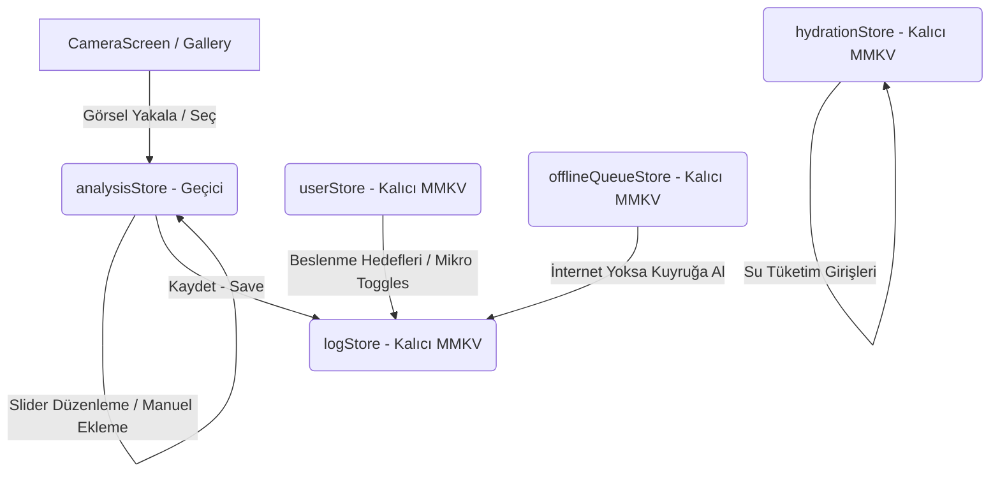

# HealthLens — Ultimate Edition Master Design Specification

**Tarih:** 2026-05-23  
**Durum:** Onaylandı  
**Yazar:** Antigravity (AI Ürün ve Mimarî Tasarım Ortağı)  
**Proje:** HealthLens Mobile (iOS Primary)

---

## 1. Genel Bakış & Ürün Hedefleri

HealthLens, kullanıcıların yemek fotoğraflarını çekerek veya galeriden yükleyerek saniyeler içinde yapay zeka destekli ayrıntılı besin analizleri almalarını sağlayan premium bir React Native mobil uygulamasıdır. 

Bu tasarım dökümanı, projenin mevcut durumundaki tüm bilinen eksikleri gideren ve uygulamayı App Store'da öne çıkacak premium özelliklerle donatan **"Ultimate Edition"** sürümünün kapsamlı mimarisini, veri modellerini ve aşamalı yol haritasını tanımlar.

### Temel Kapsam:
1. **Görsel & Dil Temelleri:** Tam Türkçe UI desteği ve özel font entegrasyonu.
2. **Gelişmiş Girdi Yolları:** Galeriden çoklu görsel aktarımı, multimodal fotoğraf analizi ve paket gıdalar için barkod okuma fallback.
3. **Akıllı AI Entegrasyonu:** Gemini 2.0 Flash API ile tip güvenli, şema bazlı besin tanıma ve klinik sağlık önerileri.
4. **Çevrimdışı Esneklik:** Ağ hatalarına karşı dayanıklı çevrimdışı analiz sırası (Offline Queue) ve otomatik arka plan senkronizasyonu.
5. **Dashboard Canlılığı:** İvmeölçer uyumlu, SVG tabanlı sinüs dalgalı ve akıcı spring animasyonlu su takip kartı (Liquid Hydration).
6. **Kayıt Yönetimi & Raporlama:** Tam öğün düzenleme/silme (CRUD) akışları ve diyetisyenle paylaşılabilecek şık PDF sağlık raporları üretimi.

---

## 2. Sistem Mimarisi & Veri Akışı

HealthLens, yerel depolama için yüksek hızlı ve performanslı `react-native-mmkv` kütüphanesini kullanır. Global durum yönetimi (State Management) ise Zustand ile kurulmuştur.



### 2.1. Zustand Durum Modelleri (Stores)

#### A. `analysisStore.ts` (Geçici - Non-persisted)
*   **Amaç:** İnceleme (Review) aşamasında olan öğün verilerini ve porsiyon düzenlemelerini tutar.
*   **Veri Yapısı:**
    ```ts
    interface AnalysisState {
      currentAnalysis: AnalysisResult | null;
      isAnalyzing: boolean;
      mealCategory: MealCategory;
      imageUris: string[]; // Çoklu fotoğraf analizi için liste
      // Eylemler
      setAnalysis: (analysis: AnalysisResult | null) => void;
      setIsAnalyzing: (loading: boolean) => void;
      addImageUri: (uri: string) => void;
      updateItemPortion: (itemId: string, grams: number) => void;
      removeItem: (itemId: string) => void;
      addItem: (item: Omit<FoodItem, 'id'>) => void;
      setMealCategory: (category: MealCategory) => void;
      reset: () => void;
    }
    ```

#### B. `hydrationStore.ts` (Yeni! Kalıcı - Persisted via MMKV)
*   **Amaç:** Sıvı efektli su takip kartının verilerini saklar.
*   **Veri Yapısı:**
    ```ts
    interface HydrationState {
      waterIntake: Record<string, number>; // dateKey (YYYY-MM-DD) -> ml
      dailyWaterGoal: number; // Varsayılan: 2500 ml
      addWater: (ml: number, dateKey: string) => void;
      removeWater: (ml: number, dateKey: string) => void;
      setWaterGoal: (ml: number) => void;
    }
    ```

#### C. `logStore.ts` (Kalıcı - Persisted via MMKV)
*   **Amaç:** Günlük yemek loglarını saklar ve tam CRUD desteği sunar.
*   **Eklenecek CRUD Eylemleri:**
    ```ts
    updateEntry: (dateKey: string, entryId: string, updatedItems: FoodItem[], category: MealCategory, totals: { cal: number, protein: number, carbs: number, fat: number }) => void;
    deleteEntry: (dateKey: string, entryId: string) => void;
    ```

---

## 3. Aşamalı Ürün Yol Haritası (Milestones)

Uygulamanın geliştirme süreci birbirine bağımlılığı en aza indiren 5 ana aşamada yürütülecektir:

### AŞAMA 1: Türkçe Dil Desteği & Görsel Dil (Temeller)
1.  **UI Lokalizasyonu:** HistoryScreen ve DashboardScreen üzerinde kalan İngilizce kelimeleri (Calories, Protein, Carbs, Fat) tamamen Türkçe'ye çevirip lokalize etmek.
2.  **Özel Fontlar:** Native iOS projesinde `HankenGrotesk` ve `Inter` font dosyalarını ekleyip CocoaPods ile bağlayarak Stitch tipografi tokens'ını aktif etmek.
3.  **Tasarım Revizyonları:** Sistem genelinde clinical-dark ve dashboard-dark renk uyumsuzluklarını ve padding/radius tokens sapmalarını Stitch standartlarına göre sabitlemek.

### AŞAMA 2: Kamera, Galeri & Dosya Sistemi
1.  **Galeri Aktarımı:** `react-native-image-picker` entegrasyonu ile kamera ekranındaki galeri butonunun çalıştırılması.
2.  **Sandbox Depolama:** Geçici çekilen veya galeriden seçilen görsellerin `mock://` yerine cihazın kalıcı sandbox Documents/Images dizinine taşınması, adlandırılması ve eski geçici görsellerin 7 gün sonra temizlenmesi.
3.  **Çoklu Fotoğraf:** analysisStore'da `imageUris[]` dizisinin yönetilmesi. Kamera ekranında kullanıcının tek öğüne 1'den fazla görsel eklemesine olanak tanıyan görsel "Staging" (Biriktirme) alanının yapılması.

### AŞAMA 3: Akıllı AI Entegrasyonu & İnceleme Ekranı
1.  **Response Schema:** Gemini 2.0 Flash API çağrılarında şema (Schema) tanımı yapılarak JSON çıktısının format kararlılığının garantiye alınması.
2.  **Multimodal Çağrı:** Çoklu görsellerin base64'e dönüştürülüp tek bir API çağrısı ile Gemini'ye gönderilmesi.
3.  **Akıllı Türkçe Arama:** İnceleme (Review) ekranında yiyecek ekleme (Add Item) tıklandığında açılan, yerel veri tabanından (~200 Türkçe besin) otomatik tamamlamalı hızlı besin seçme modülü.
4.  **AI Smart Insights:** Gemini'den gelen sodyum, şeker, yağ dağılımına göre kullanıcıya klinik tavsiye üreten Türkçe ipucu kartı.

### AŞAMA 4: Çevrimdışı Esneklik & Canlı Dashboard
1.  **Offline Queue:** Ağ bağlantısı olmadığında ya da timeout durumunda görselin yerel diske kaydedilerek offlineQueueStore'a eklenmesi.
2.  **Sync Göstergesi:** Dashboard ekranında puls (nabız) animasyonuna sahip "Senkronize Edilmeyi Bekleyen Kayıtlar" kartı. Arka planda internet bağlantısı geldiğinde otomatik tetiklenen sync döngüsü.
3.  **Sıvı Efektli Su Kartı:** `react-native-svg` ile çizilen, `Animated` sinüs formülüyle dalgalanan ve spring animasyonuyla dolan interaktif su takip modülü.

### AŞAMA 5: Geçmiş Analizi, CRUD & İhracat
1.  **Öğün Düzenleme (Full CRUD):** Dashboard veya History listesindeki bir öğüne tıklandığında Review ekranının "Düzenleme Modu" olarak açılması ve güncellemelerin diske yansıtılması.
2.  **PDF Raporlama:** Son 7 günlük beslenme verilerini şık bir klinik PDF dökümanına döküp iOS Share Sheet aracılığıyla paylaşılmasını sağlamak.
3.  **Barkod Fallback:** `react-native-camera-kit` barkod modunun aktif edilmesi ve paket gıdaların barkodunu okutarak hızlıca öğüne eklenebilmesi.

---

## 4. Teknik Ayrıntılar & Kütüphane Tercihleri

*   **Görsel Seçimi:** `react-native-image-picker` (Galeri erişimi ve izin yönetimi için).
*   **Dosya Yönetimi:** `react-native-fs` (Fotoğrafların sandbox Documents dizinine taşınması ve silinmesi).
*   **Yapay Zeka:** `@google/genai` (Resmi Google GenAI SDK'sı).
*   **Tasarım & Animasyon:** `react-native-svg` ve yerleşik `Animated` (Sıvı dalgalanma efekti için).
*   **Paylaşım:** Yerleşik `Share` modülü (Rapor ihracatı için).

---

## 5. Doğrulama & Test Stratejisi

1.  **Unit Tests:** Her store'un (özellikle `hydrationStore` ve güncellenen `logStore`) CRUD eylemlerinin Jest birim testleri ile kapsanması.
2.  **UI & Animasyon Performansı:** Canlı dalga animasyonunun iOS simulator ve cihazlarında 60 FPS'te akıcı çalışmasının doğrulanması (JS Thread blokaj kontrolü).
3.  **Hata Senaryoları:** İnternet bağlantısı kesildiğinde API'nin timeout durumuna düşmesi ve offline queue mekanizmasının devreye girdiğinin görsel olarak teyit edilmesi.
