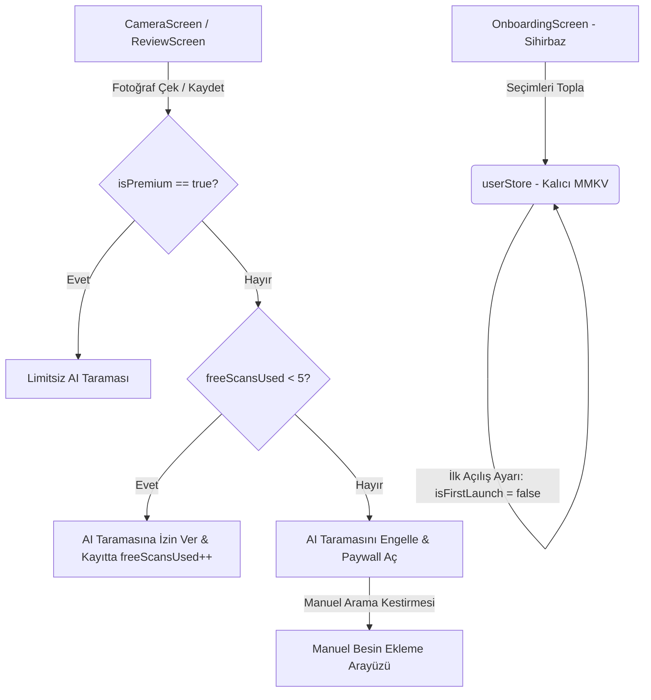

# HealthLens Onboarding Wizard, Dynamic Goals & Premium Paywall Design Specification

**Tarih:** 2026-05-24  
**Durum:** Onaylandı  
**Yazar:** Antigravity (AI Ürün ve Mimarî Tasarım Ortağı)  
**Proje:** HealthLens Mobile (iOS Primary)

---

## 1. Genel Bakış & Ürün Hedefleri

Bu spesifikasyon dökümanı, HealthLens'i genel bir kalori sayma uygulamasından çıkarıp, kullanıcıların belirli klinik sağlık problemlerini çözmesini hedefleyen interaktif bir dijital sağlık asistanına dönüştürmek için tasarlanmış özellikleri tanımlar.

### Temel Amaçlar:
1. **Sağlık Odaklı Sihirbaz (Onboarding Wizard):** Kullanıcının motivasyonunu, sağlık sorunlarını (Hipertansiyon, Diyabet, Hassas Bağırsak vb.) ve fizyolojik verilerini toplar.
2. **Dinamik Klinik Hedef Sistemi (Clinical Goal Engine):** Sihirbazda seçilen sağlık hedefine göre günlük besin hedeflerini, sodyum/lif/şeker takip durumlarını ve klinik besin notlarını (`healthGrader.ts`) dinamik olarak ayarlar.
3. **Mali Sürdürülebilirlik & Premium Limit Sistemi (5 Free Scans Paywall Gate):** AI kamerasını denemek için 5 adet ömür boyu ücretsiz tarama hakkı tanımlar. Haklar tükendiğinde AI kamerasını Premium Pro paywall ($9.99/ay) arkasına kilitler.
4. **Manuel Ekleme Kestirme Köprüsü:** Hakkı biten kullanıcıların uygulamayı terk etmemesi için, manuel arama ve besin ekleme sistemini ücretsiz ve sınırsız sunar.

---

## 2. Sistem Mimarisi & Veri Akışı



### 2.1. Veri Yapısı (Zustand & MMKV Güncellemeleri)

`src/stores/userStore.ts` içerisindeki `UserProfile` arayüzü aşağıdaki şekilde güncellenecektir:

```ts
export type HealthGoal = 'hypertension' | 'diabetes' | 'gut_health' | 'weight_management' | null;

export interface UserProfile {
  isFirstLaunch: boolean;     // Varsayılan: true (İlk açılışta OnboardingScreen'i tetikler)
  isPremium: boolean;         // Varsayılan: false (Ödeme duvarı onayında true olur)
  freeScansUsed: number;      // Varsayılan: 0 (En fazla 5 adet)
  healthGoal: HealthGoal;     // Kullanıcının klinik sağlık odak noktası
  age?: number;
  height?: number;
  weight?: number;
  gender?: 'male' | 'female' | 'other';
  goals: NutritionGoals;      // Seçilen sağlık hedefine göre dinamik kalibre edilir
}
```

---

## 3. Dinamik Klinik Hedef & Puanlama Kuralları

Kullanıcının sihirbazda seçtiği `healthGoal` değerine göre, `src/utils/healthGrader.ts` ve besin puanlama kuralları şu şekilde şekillenir:

### A. Hipertansiyon & Kalp Sağlığı (`hypertension`)
* **Dinamik Ayarlar:** Sodyum takibi varsayılan olarak açılır. Günlük sodyum hedefi `goals.sodiumGoal` **1500 mg** olarak sabitlenir.
* **Cezalandırma Kuralı:** Gıdaların sodyum (tuz) oranı 100g'da `300 mg` değerini aşıyorsa, besin notu ne kadar yüksek olursa olsun en fazla **C** veya **D** olarak sınırlandırılır.

### B. Kan Şekeri Kontrolü & Diyabet (`diabetes`)
* **Dinamik Ayarlar:** Şeker takibi varsayılan olarak açılır. Günlük şeker hedefi `goals.sugarGoal` **35 g** olarak kısıtlanır.
* **Cezalandırma Kuralı:** Gıdaların şeker oranı 100g'da `12 g` değerini aşıyorsa veya karbonhidrat glisemik yükü yüksekse besin notu en fazla **C** seviyesine sınırlandırılır.

### C. Sindirim & Bağırsak Sağlığı (`gut_health`)
* **Dinamik Ayarlar:** Lif takibi varsayılan olarak açılır. Günlük lif hedefi `goals.fiberGoal` **35 g** seviyesine yükseltilir.
* **Ödüllendirme Kuralı:** Lif oranı 100g'da `3 g` değerini aşan gıdalar ek puan alarak otomatikman **A+** ve **A** derecelerine yükseltilir.

### D. Kilo Yönetimi & Kas Sağlığı (`weight_management`)
* **Dinamik Ayarlar:** Standart kalorifer hedefleri kalibre edilir. Protein hedefi kullanıcının ağırlığının 1.5 katı (`weight * 1.5` g/gün) olarak hesaplanır. Sodyum, lif ve şeker takipleri standart seviyelerde bırakılır.

---

## 4. Ekran Tasarımları & Navigasyon Akışı

### 4.1. Sihirbaz Ekranı (`src/screens/OnboardingScreen.tsx`) [YENİ]
Yatayda kayan şık clinical-dark kart yapısına sahip aşamalı arayüz:
* **Kart 1: Sağlık Hedefi:** Tansiyon, Diyabet, Sindirim Sağlığı veya Kilo Yönetimi butonları.
* **Kart 2: Fizyolojik İstatistikler:** Yaş, Kilo, Boy ve Cinsiyet girdileri.
* **Kart 3: Başarı Projeksiyonu (Success Forecast Chart):** Girilen ağırlık ve sağlık hedefine göre dinamik başarı tarihi hesaplayan visual kart ("Tansiyonunuzu 8 hafta içinde dengeleyebilirsiniz: **[Tarih]**").
* **Kart 4: Premium Paywall:** 
  * "Kişisel Sağlık Planınız Hazır" başlığı.
  * Pro sürümün 3 büyük klinik avantajı (AI Scan Overlay, Food Health Grades, Voice NLP, PDF Reports).
  * $9.99/ay abonelik ve 3 günlük ücretsiz deneme seçenekleri.
  * En altta kısıtlı ücretsiz sürüm için "Kısıtlı Sürümü Dene (5 ücretsiz hak)" butonu.

### 4.2. Paywall Modalı (`src/screens/PaywallScreen.tsx`) [YENİ]
* Taraması kilitlenen veya Ayarlar ekranından Premium kartına dokunan kullanıcılara açılacak tam ekran premium ekranı.
* *Ömür Boyu 5 Tarama Hakkı* dolduğunda devreye girecek uyarı metni: *"5 ücretsiz tarama hakkınız dolmuştur. Manuel kayda devam edebilir veya limitsiz klinik analiz için Premium Pro'ya geçebilirsiniz."*
* App Store entegrasyonu simülasyonu ($9.99/ay).

### 4.3. Kamera Ekranı Koruma Katmanı (`src/screens/CameraScreen.tsx`)
* Kamera önizlemesinde veya çekim butonunda `isPremium` kontrolü yapılır.
* `isPremium == false` ve `freeScansUsed >= 5` ise, çekim butonu kilitlenir veya butona basıldığında doğrudan `Paywall` açılır.
* `freeScansUsed < 5` ise, ekranın üst barında `5 Hak / [X] Hak Kaldı` minyatür göstergesi listelenir. Tüketilen hak, yiyecek Review ekranında kaydedildiğinde 1 artırılır.
* Hakkı biten kullanıcılar için kamera altına şık bir **"Manuel Yemek Ekle"** butonu yerleştirilerek doğrudan arama modülü tetiklenir.

---

## 5. Doğrulama & Test Planı

1. **Zustand Birim Testleri:**
   * `Onboarding` seçimlerinin `userStore`'a kaydedildiğinin ve ilk açılış değişkeninin başarıyla `false` yapıldığının test edilmesi.
   * 5 tarama hakkı artışının ve premium flag değiştiğinde tarama kapısının başarıyla açıldığının doğrulanması.
2. **Klinik Derecelendirme Testleri (`healthGrader.test.ts`):**
   * Hipertansiyon modunda yüksek sodyumlu yemeklerin en fazla `C` notu alabildiğinin birim testlerle kanıtlanması.
   * Diyabet modunda yüksek şekerli gıdaların sınırlandırıldığının teyidi.
3. **Manuel Akış Testi:**
   * 5 hakkı dolan kullanıcının kamerada bloklandıktan sonra "Manuel Ekle" butonuna basarak arama ekranından öğün kaydedebildiğinin simülatörde görsel olarak test edilmesi.

---

---

## 6. Sosyal Giriş/Çıkış ve Sihirbazı Sıfırlama Spesifikasyonları [YENİ]

### 6.1. Zustand Durum Modeli Genişletmesi (`userStore.ts`)
`UserProfile` yapısına eklenecek alanlar ve durum güncellemeleri:
* `profile.email: string | null` (Giriş yapan kullanıcının e-posta adresi).
* `profile.loginMethod: 'google' | 'apple' | null` (Aktif OAuth kanalı).
* **Yeni Eylemler:**
  * `loginUser(email: string, method: 'google' | 'apple')`: E-posta ve giriş metodunu yazar, **isPremium'u otomatik true yapar** (Premium Pro deneme sürümünü aktif eder).
  * `logoutUser()`: E-posta ve metodu sıfırlar, premium durumunu iptal eder (`isPremium = false`) ve `freeScansUsed = 0` yapar (çıkış yapan kullanıcının 5 hakkı sıfırlanır).
  * `resetOnboarding()`: `isFirstLaunch = true` yaparak kullanıcının pürüzsüz bir React re-render ile Onboarding Sihirbazına dönmesini sağlar.

### 6.2. Ayarlar Ekranı Arayüzü (`ProfileScreen.tsx`)
* **Bulut Senkronizasyonu & Giriş Bento Kartı:**
  * Giriş yapılmamışsa: Turuncu parlayan **"BULUT ÇEVRİMDIŞI"** rozeti gösterilir. Altında yan yana mock **"Google ile Giriş Yap"** (beyaz) ve **"Apple ile Giriş Yap"** (siyah) butonları yer alır. Butona tıklandığında bir mock mail girilerek login olunur ve Pro Pro sürüm aktifleşir.
  * Giriş yapılmışsa: Kullanıcının e-postası ve yeşil parlayan **"Bulut Aktif & Senkronize"** rozeti listelenir. Altında şık kırmızı neon sınırlı **"Çıkış Yap"** butonu bulunur.
* **Sihirbazı Sıfırlama Butonu:**
  * Ayarlar sayfasına clinical-dark renk tonlarına uyumlu, parlayan zümrüt yeşili neon sınıra sahip **"🔄 Sağlık Sihirbazını Baştan Başlat"** butonu eklenir.
  * Tıklanıldığında bir doğrulama uyarısı (`Alert.alert`) çıkar ve onaylandığında `resetOnboarding()` eylemi çağrılarak sihirbaza dönülür.

---

## 7. Spec Kendi Kendine İnceleme (Self-Review)

* **Yer Yer Tutucu (Placeholder) Kontrolü:** "TBD" veya eksik formül bulunmuyor, tüm hedefler ve sayılar ($9.99/ay ve 5 ücretsiz hak) netleştirildi.
* **Tutarlılık:** `userStore` MMKV yapısı ve `healthGrader` ceza katsayıları birbirini destekler nitelikte tasarlandı.
* **Kapsam:** Yalnızca onboarding, dinamik hedefler, 5 hak kısıt kapısı, paywall ekranları, sosyal giriş/çıkış ve sihirbaz sıfırlamayı kapsayan, tek bir uygulama planıyla hayata geçirilebilecek netliktedir.
